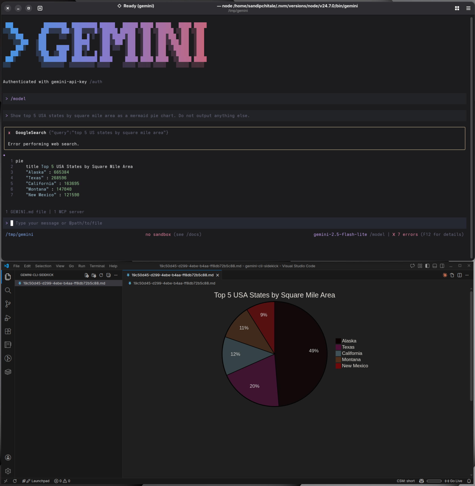

# Sidekick Gemini CLI extensions

This implements hooks for Gemini CLI to provide the following hooks.

## Key Idea

`gemini` cli is terminal based chat interface. This means it is incapable of rendering rich output like HTML tables, Mermaid charts etc. This extension provides a way to render rich output in VSCode.

## Lifecycle Hooks

- `session-start`: Called when a new session is started. This launches VSCode.
- `before-model`: Called before a model is invoked. This clears the per session file.
- `after-model`: Called after a model is invoked. This appends the model response to the per session file.
- With each volley with the model, the above two hooks are called. **If there is any rich output in the model response, it is rendered in VSCode.**. Thus the VSCode acts as a sidekick to the Gemini CLI like Robin to Batman
- `session-end`: Called when a new session ends. This delets the per session file.

## Screenshots



### Prerequisites

- Node.js 23.6+
- npm
- Gemini CLI
- VSCode
  - `code` command in your path
  - (optional) Mermaid extension for Mermaid charts

## Installation

### Steps

```bash
git clone https://github.com/sandipchitale/sidekick.git
cd sidekick
npm install
gemini extension link .
```
